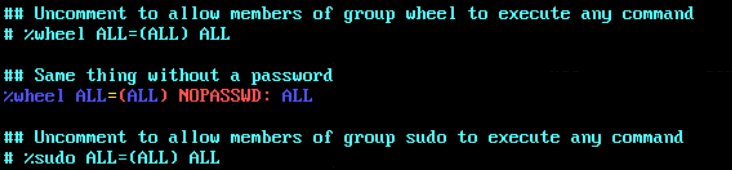
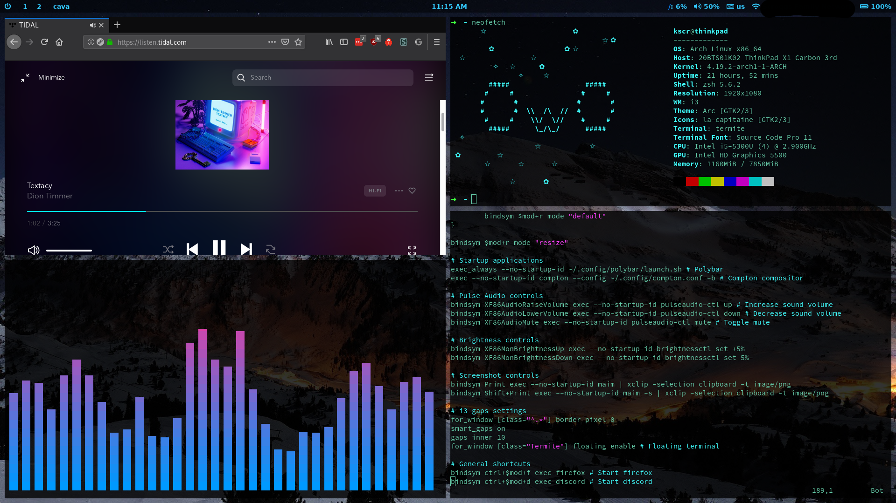

# i3-rice
Dotfiles and other saved configurations for my i3-gaps rice.

## Programs I use in my rice
* [i3-gaps](https://github.com/Airblader/i3)
* [Polybar](https://github.com/jaagr/polybar)
* [Termite](https://github.com/thestinger/termite)
* [Compton](https://github.com/chjj/compton)
* Zsh & [oh-my-zsh](https://github.com/robbyrussell/oh-my-zsh)
* [Rofi](https://github.com/DaveDavenport/rofi)
* [i3lock-fancy](https://github.com/meskarune/i3lock-fancy)
* [maim](https://github.com/naelstrof/maim)

## Distro specific files
1. [Pacman](pacman) contains configs and hooks for use with pacman, which will only be useful on Arch Linux based distributions.
2. [Install.sh](install.sh) will automatically install and set up this rice on a fresh installation of *any Arch Linux based distro*. It cannot and will not work on other distributions.

# Installation
1. Using visudo, uncomment the line `%wheel ALL=(ALL) NOPASSWD: ALL`. **_Don't uncomment the line above it instead. This will prevent the install script from working properly due to a flaw in how `su` works._**

2. Create a normal user that's part of the `wheel` group.
```
# useradd -m -G wheel fooman
```
3. Install `git` and `yay`.
```
# pacman -S git
# su fooman
$ cd ~
$ git clone https://aur.archlinux.org/yay.git
$ cd yay
$ makepkg -sri
$ cd ..
$ rm -rf yay
$ exit
```
4. Finally, clone this repo and run [install.sh](install.sh) as root.
```
# git clone https://github.com/amused-af/i3-rice.git
# cd i3-rice
# chmod +x install.sh
# ./install.sh
```

## Screenshots


